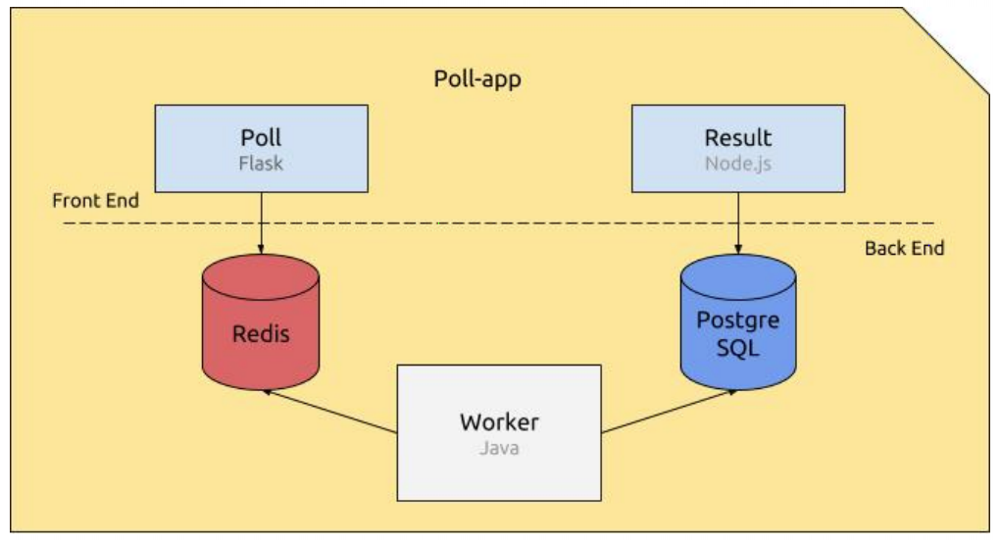

# Epitech Automation

## Description

L'objectif de ce projet était d'apprendre à mettre en place une configuration et un déploiement automatisé de plusieurs services sur différentes machines grâce à Ansible.

## Services

* Poll: Il s'agit d'une application web en flask permettant à un utilisateur de voter
* Worker: C'est une application Java qui récupère les votes stockés dans la file d'attente Redis, puis les insère dans la base de données PostgreSQL
* Result: Cette application web en NodeJS permet de récupèrer les votes dans la base de données et d'afficher les résultats

## Schéma

